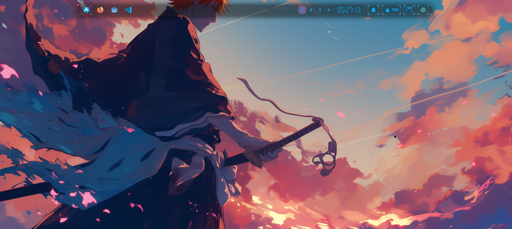
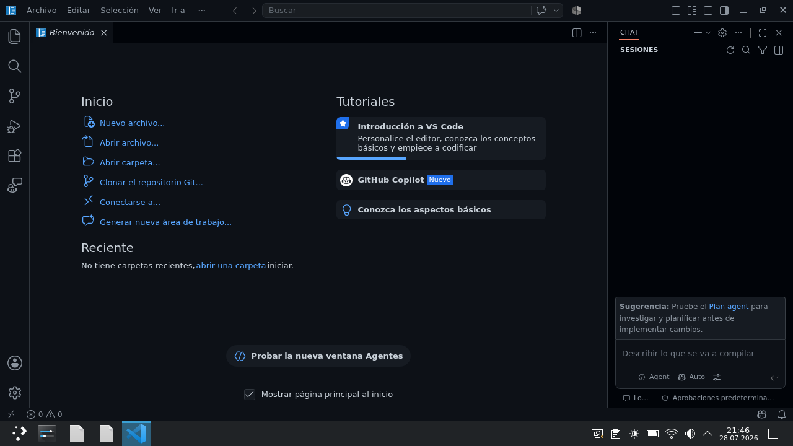
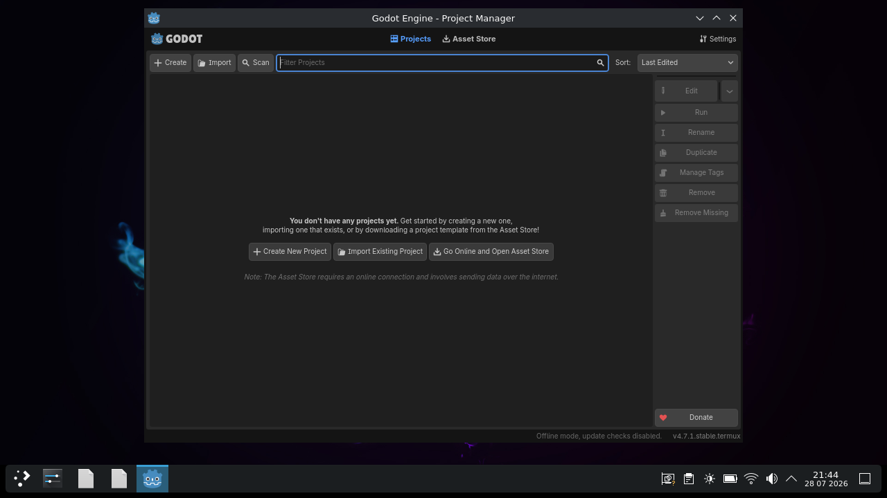
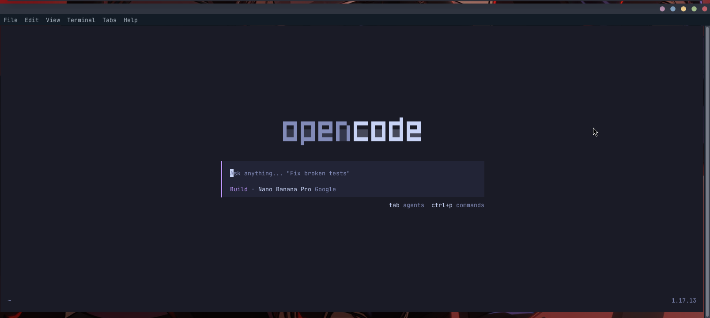
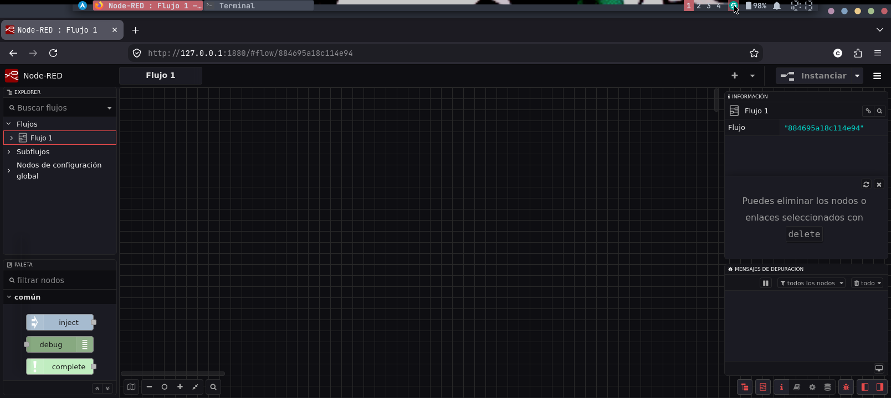
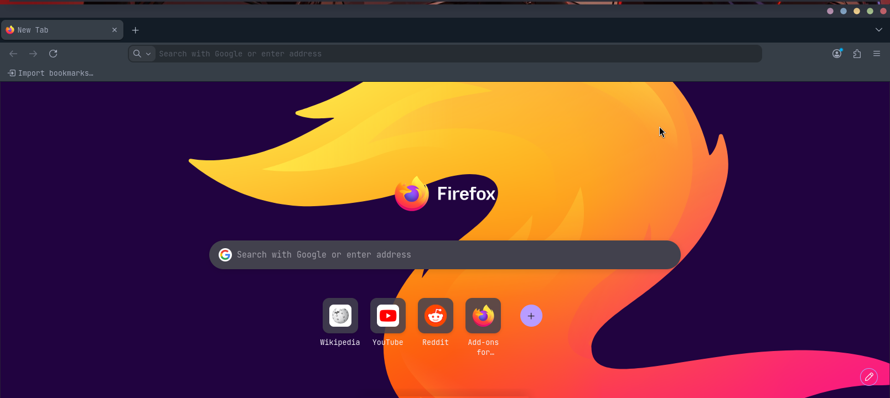

# 📱 Termux-Dev-Station: La Estación de Desarrollo Nativa Definitiva en Android
**Un proyecto de Systemic Flow**


<div align="center">

🌐 **Idiomas disponibles / Available Languages:**

[🇪🇸 Español](README.md) | [🇺🇸 English](README_EN.md) | [🇨🇳 中文](README_ZH.md) | [🇧🇷 Português](README_PT.md)

</div>

¡Bienvenido! Si alguna vez has querido transformar tu dispositivo Android (en modo DeX, conectado a un monitor externo o directamente en tu tablet/móvil) en una auténtica computadora de desarrollo sin necesidad de root, pesadas capas de emulación, ni scripts mágicos y oscuros, estás en el lugar correcto.

Esta guía rompe con el mito de que necesitas instalar sistemas operativos enteros para programar de verdad en un teléfono. Aquí combinamos **rendimiento nativo, editores ligeros y aceleración gráfica directa** para construir un entorno 100% estable. 

La guía une lo mejor de dos mundos: **una explicación amigable, accesible y paso a paso** para que cualquier usuario comprenda qué ocurre en su dispositivo, junto con **la precisión técnica exacta**, comandos completos y scripts de automatización listos para exprimir tu hardware al máximo.

---

## 💡 Filosofía del Proyecto y Transparencia

He recorrido el camino de probar guías desactualizadas, emuladores pesados y scripts automáticos que instalan distribuciones de Linux enteras (PRoot) y terminan sobrecargando el sistema operativo sin que sepas qué pasó. Esta guía es diferente: **es 100% nativa de Termux** y **no** utiliza automatizaciones a ciegas.

Aquí no hay capas intermedias. Usamos el ecosistema puro de Termux para lograr el rendimiento real del hardware de tu dispositivo. Cada paso está diseñado para que comprendas exactamente qué se está instalando y configurando.

Ya sea que estés maquetando interfaces web con **HTML, CSS y JS**, programando mecánicas en **Godot Engine**, automatizando flujos con **n8n**, o programando con la ayuda de una **IA**, entender tu entorno a nivel nativo te dará el control absoluto, eliminando la latencia y garantizando que tu estación sea ágil y estable.

---

## 🖼️ Vista Previa del Entorno

Así es como luce tu estación de trabajo una vez completado el proceso y aplicada la personalización de Systemic Flow:

| Escritorio XFCE (Optimizado y Moderno) | Editor de código (Code OSS) |
| :---: | :---: |
|  |  |

| Motor de videojuegos Godot | Asistente de IA con OpenCode |
| :---: | :---: |
|  |  |

| Automatización con Node-RED | Navegación Web (Firefox) |
| :---: | :---: |
|  |  |

---

## 📍 Índice de Contenidos

1. [⚡ Arquitectura Híbrida de Aceleración (VirGL + Vulkan + ANGLE)](#-arquitectura-híbrida-de-aceleración-virgl--vulkan--angle)
2. [📋 Entorno y Servidor Gráfico](#-entorno-y-servidor-gráfico)
3. [🚀 Paso Previo: Preparando Termux](#-paso-previo-preparando-termux)
4. [🛠️ Guía de Instalación Paso a Paso (Manual)](#️-guía-de-instalación-paso-a-paso-manual)
   * [Fase 1: Preparación del Sistema Base](#fase-1-preparación-del-sistema-base)
   * [Fase 2: Repositorios, Utilidades del Sistema y Capa de Aceleración Gráfica (VirGL)](#fase-2-repositorios-utilidades-del-sistema-y-capa-de-aceleración-gráfica-virgl)
   * [Fase 3: Asistentes de Inteligencia Artificial (Ollama + OpenCode + API Gemini)](#fase-3-asistentes-de-inteligencia-artificial-ollama--opencode--api-gemini)
   * [Fase 4: Despliegue de Node-RED y Limpieza Inteligente de Espacio](#fase-4-despliegue-de-node-red-y-limpieza-inteligente-de-espacio)
   * [Fase 5: Instalación del Escritorio XFCE, Servidores Gráficos y Herramientas](#fase-5-instalación-del-escritorio-xfce-servidores-gráficos-y-herramientas)
   * [Fase 6: Solución al Bloqueo de Procesos Fantasma (Android 12+)](#fase-6-solución-al-bloqueo-de-procesos-fantasma-android-12)
   * [Fase 7: Configuración de Arranque (`xstartup` para VNC)](#fase-7-configuración-de-arranque-xstartup-para-vnc)
   * [Fase 8: Personalización Visual y Estética (Systemic Flow)](#fase-8-personalización-visual-y-estética-systemic-flow)
   * [Fase 9: Habilitar Aceleración GPU en Lanzadores (Opcional)](#fase-9-habilitar-aceleración-gpu-en-lanzadores-opcional)
5. [🕹️ Scripts de Automatización (`up`, `on`, `vnc-on`, `off`)](#️-scripts-de-automatización-up-on-vnc-on-off)
6. [📜 Licencia](#-licencia)
   
---
   
## ⚡ Arquitectura Híbrida de Aceleración (VirGL + Vulkan + ANGLE)

A diferencia de la mayoría de guías limitadas a procesadores Snapdragon (Adreno), esta configuración habilita la **aceleración gráfica por GPU real en procesadores con GPU Mali** (MediaTek, Exynos, etc.) mediante una cadena de traducción nativa. 

El verdadero secreto del rendimiento de Systemic Flow radica en nuestra **arquitectura bajo demanda**: 
1. Renderizamos el entorno de escritorio por software (CPU) para garantizar una estabilidad absoluta, eliminando de raíz las pantallas negras y los cuelgues (errores `BadMatch`).
2. Delegamos el procesamiento 3D a la GPU de forma aislada **solo** para las aplicaciones que lo exigen (como Godot Engine o Firefox).

Con este método, el rendimiento se dispara, la fluidez es total y tu dispositivo se mantiene fresco (~36 °C) incluso bajo tareas pesadas.

---

## 📋 Entorno y Servidor Gráfico

Para asegurar que tu dispositivo rinda al máximo sin devorar la memoria RAM, hemos optimizado las opciones:

### 1. El Escritorio: XFCE4
* **XFCE:** Ligero, sumamente rápido y minimalista. Es el estándar de esta guía. Más adelante te mostraremos cómo personalizarlo con paneles y menús para que luzca tan moderno y profesional como entornos más pesados, pero consumiendo una fracción de los recursos.

### 2. Elección del Servidor Gráfico (Display Server)
* **X11 Nativo (`termux-x11-nightly`):** Renderizado directo en la pantalla del dispositivo mediante su app dedicada (`DISPLAY=:0`), ofreciendo la menor latencia posible y la mejor integración táctil. Es la opción principal recomendada.
* **Servidor VNC (TigerVNC):** Clásico y universal. Lo mantenemos como una excelente alternativa para aquellos usuarios que necesitan trabajar en pantallas grandes y no cuentan con un proyector, puerto HDMI o modo DeX. Te permite conectarte a `127.0.0.1:5901` desde cualquier visor VNC en un monitor externo vía red local. 

*¡Instalaremos ambas opciones para que tengas total flexibilidad!*

---

## 🚀 Paso Previo: Preparando Termux

Para evitar incompatibilidades con paquetes universales pesados, te recomendamos descargar el APK de Termux adecuado para tu arquitectura (preferiblemente **`arm64-v8a`** desde los Releases oficiales de GitHub en lugar de F-Droid, reduciendo el tamaño base a ~30 MB).

---

## 🛠️ Guía de Instalación Paso a Paso (Manual)

### Fase 1: Preparación del Sistema Base
Otorgamos permisos de almacenamiento, actualizamos espejos (opcional si deseas cambiar de servidor) y ponemos al día los paquetes del sistema:

```bash
termux-setup-storage
termux-change-repo  # (Opcional: ejecuta esto si deseas cambiar los espejos de repositorios)
apt list --upgradable
apt full-upgrade -y
```

### Fase 2: Repositorios, Utilidades del Sistema y Capa de Aceleración Gráfica (VirGL)
Añadimos los repositorios comunitarios esenciales (`tur-repo`, `x11-repo`), herramientas de red, utilidades del sistema imprescindibles para gestión de procesos (`procps` para `killall` y `pkill`), decoraciones de terminal (`figlet`, `neofetch`) y preparamos la capa de aceleración gráfica avanzada para procesadores Mali mediante ANGLE y Vulkan:

```bash
pkg install tur-repo x11-repo -y
pkg install git unzip wget curl ripgrep procps figlet neofetch -y
pkg install virglrenderer virglrenderer-android angle-android vulkan-loader-generic openssl -y

# 1. Eliminar renderizadores por software conflictivos si existieran
pkg remove '*icd-swrast' 2>/dev/null

# 2. Instalar el wrapper de Vulkan para Mesa
wget 'https://github.com/ar37-rs/virgl-angle/releases/download/latest/mesa-vulkan-icd-wrapper_25.0.0-1_aarch64.deb'
dpkg -i mesa-vulkan-icd-wrapper_25.0.0-1_aarch64.deb
rm mesa-vulkan-icd-wrapper_25.0.0-1_aarch64.deb

# 3. Instalar herramienta vgl para gestionar el arranque del servidor gráfico
wget 'https://github.com/ar37-rs/virgl-angle/raw/refs/heads/main/vgl'
chmod +x vgl && mv vgl $PREFIX/bin/
```

### Fase 3: Asistentes de Inteligencia Artificial (Ollama + OpenCode + API Gemini)
Mantendremos herramientas locales de IA y te recomendaremos el mejor estándar en la nube:

1. **Instalación de Ollama y Modelo Local:**
   ```bash
   pkg install ollama -y
   ollama serve &
   ```
   *(En otra pestaña de Termux)*:
   ```bash
   ollama pull qwen2.5-coder:1.5b
   ```

2. **Binarios de OpenCode:**
```bash
# 1. Obtener la URL de descarga limpia
LATEST_OPCODE=$(curl -s "https://api.github.com/repos/Haris131/opencode-termux/releases/latest" | grep "browser_download_url" | grep "aarch64.zip" | cut -d '"' -f 4)

# 2. Descargar, dar permisos e instalar el binario en la ruta del sistema
curl -L -o opencode.zip "$LATEST_OPCODE"
unzip opencode.zip
chmod +x opencode
mv opencode $PREFIX/bin/

# 3. Limpiar el archivo comprimido residual
rm opencode.zip
```

3. **Configuración de Variables (`~/.bashrc`):**
   Puedes configurar tu archivo `~/.bashrc` con la siguiente estructura (que incluye bienvenida con `figlet` y `neofetch`, variables de entorno y soporte de IA local/cloud):
  ```bash
cat << 'EOF' >> ~/.bashrc
# Configuración de Idioma / Localización (Español UTF-8)
export LANG=es_ES.UTF-8
export LANGUAGE=es_ES.UTF-8
export LC_ALL=C.UTF-8

# Alias para habilitar la GPU bajo demanda en apps pesadas (ej: gpu godot4)
alias gpu='env -u LIBGL_ALWAYS_SOFTWARE GALLIUM_DRIVER=virpipe MESA_GL_VERSION_OVERRIDE=4.1COMPAT MESA_GLSL_VERSION_OVERRIDE=410'

# Variables de Entorno de IA (Ollama, Gemini, OpenRouter)
export OPENAI_API_KEY="ollama"
export OPENAI_API_BASE="http://localhost:11434/v1"
export GEMINI_API_KEY="tu-api-key-de-gemini-aqui"
export OPENROUTER_API_KEY="tu-api-key-de-openrouter-aqui"

clear
echo 'Systemic Flow Dev Station' | figlet 2>/dev/null || echo 'Termux Dev Station'
neofetch 2>/dev/null || true
EOF
source ~/.bashrc
   ```

### Fase 4: Despliegue de Node-RED y Limpieza Inteligente de Espacio
Instalamos la plataforma de automatización liviana basada en eventos (Node-RED) y realizamos una rutina de limpieza profunda para liberar espacio:

```bash
curl -o termux-nodered-native.sh 'https://raw.githubusercontent.com/Yerensoncasares/termux-dev-station/main/termux-nodered-native.sh'
chmod +x termux-nodered-native.sh
bash termux-nodered-native.sh

# Rutina de limpieza de almacenamiento
npm cache clean --force && pip cache purge 2>/dev/null
pkg clean && apt autoremove --purge -y
rm -rf $PREFIX/tmp/*
```

### Fase 5: Instalación del Escritorio XFCE, Servidores Gráficos y Herramientas
Instalamos el entorno gráfico XFCE4 junto a sus complementos esenciales, los servidores de visualización (`TigerVNC` y el paquete nativo `termux-x11-nightly`), además del sistema de audio y las herramientas de desarrollo nativas:

```bash
# Entorno XFCE ultraligero y administrador de archivos
pkg install xfce4 xfce4-goodies thunar htop -y 

# Servidores gráficos y herramientas ADB
pkg install tigervnc android-tools -y
pkg install termux-x11-nightly -y  # Servidor X11 nativo de alta fluidez

# Multimedia, desarrollo y editores de código nativos
pkg install pulseaudio firefox godot python nodejs code-oss -y
```

### Fase 6: Solución al Bloqueo de Procesos Fantasma (Android 12+)
Para evitar que Android mate tus procesos en segundo plano al cambiar de app, utiliza ADB Inalámbrico desde Opciones de Desarrollador:

```bash
adb pair 192.168.xxx.xxx:xxxxx xxxxxx
adb connect 192.168.xxx.xxx:xxxxx
adb shell "/system/bin/device_config set_sync_disabled_for_tests persistent"
adb shell "/system/bin/device_config put activity_manager max_phantom_processes 2147483647"
adb shell settings put global settings_enable_monitor_phantom_procs false
```

### Fase 7: Configuración de Arranque (`xstartup` para VNC)
Si decides usar VNC, configura tu archivo de inicio `~/.vnc/xstartup`:

1. Inicializa el servidor VNC para generar la estructura:
   ```bash
   vncserver && vncserver -kill :1
   ```
2. Edita `~/.vnc/xstartup`:
```bash
cat << 'EOF' > ~/.vnc/xstartup
#!/data/data/com.termux/files/usr/bin/sh

localhost="no"

# Forzar renderizado por software para el entorno XFCE (máxima estabilidad)
export LIBGL_ALWAYS_SOFTWARE=1
export GALLIUM_DRIVER=llvmpipe

xset s off &
xset -dpms &

# Localización y variables temporales
export LANG=es_ES.UTF-8
export LANGUAGE=es_ES.UTF-8
export LC_ALL=C.UTF-8
export TMPDIR=/data/data/com.termux/files/usr/tmp
export XDG_RUNTIME_DIR=${TMPDIR}

# Cargar recursos y lanzar sesión XFCE
[ -r $HOME/.Xresources ] && xrdb $HOME/.Xresources
dbus-launch --exit-with-session startxfce4
EOF
chmod +x ~/.vnc/xstartup
```

---

### Fase 8: Personalización Visual y Estética (Systemic Flow)
Para que tu entorno luzca moderno y minimalista, instalaremos los temas de interfaz, la línea de comandos interactiva y los iconos.

Ejecuta el siguiente bloque para instalar `starship` (con el preset Tokyo Night), `lsd` y descargar el paquete completo de recursos (*assets*) de Systemic Flow (fuentes, temas GTK y cursores) directamente desde nuestro release oficial:

```bash
# 1. Instalación de temas oficiales y utilidades de terminal
pkg install arc-gtk-theme papirus-icon-theme starship lsd fontconfig-utils -y

# 2. Configuración del prompt Starship (Preset Tokyo Night)
mkdir -p ~/.config
starship preset tokyo-night -o ~/.config/starship.toml

# 3. Limpieza e instalación del paquete de assets visuales
rm -rf ~/.fonts ~/.themes ~/.icons ~/assets.zip
curl -L -o ~/assets.zip "https://github.com/Yerensoncasares/termux-dev-station/releases/download/V1.0/assets.zip"
unzip -o ~/assets.zip -d ~/
rm ~/assets.zip
fc-cache -fv

# 4. Inyección limpia de alias y Starship en ~/.bashrc
grep -q 'starship init bash' ~/.bashrc || echo 'eval "$(starship init bash)"' >> ~/.bashrc
grep -q 'alias ls="lsd"' ~/.bashrc || echo 'alias ls="lsd"' >> ~/.bashrc

# 5. Aplicar cambios en la sesión actual
source ~/.bashrc
```

 ---
 
 ### Fase 9: Habilitar Aceleración GPU en Lanzadores (Opcional)
Nuestra arquitectura renderiza la interfaz por software para máxima estabilidad, pero puedes habilitar la GPU bajo demanda para aplicaciones pesadas (como **Code-OSS**, **Godot Engine** o **Firefox**) sin necesidad de usar la terminal.

Para abrirlos directamente desde el Menú Whisker o el Panel inferior con aceleración por hardware:

1. Haz clic derecho sobre la aplicación en el Menú Whisker o en el Panel y selecciona **Editar aplicación** (o *Propiedades*).
2. En la casilla **Comando**, antepone el siguiente prefijo de GPU antes de la ruta del programa:

`env -u LIBGL_ALWAYS_SOFTWARE GALLIUM_DRIVER=virpipe MESA_GL_VERSION_OVERRIDE=4.1COMPAT MESA_GLSL_VERSION_OVERRIDE=410`

**Ejemplos de cómo debe quedar la línea completa:**
* **Code-OSS:** `env -u LIBGL_ALWAYS_SOFTWARE GALLIUM_DRIVER=virpipe MESA_GL_VERSION_OVERRIDE=4.1COMPAT MESA_GLSL_VERSION_OVERRIDE=410 /data/data/com.termux/files/usr/bin/code-oss %F`
* **Godot Engine:** `env -u LIBGL_ALWAYS_SOFTWARE GALLIUM_DRIVER=virpipe MESA_GL_VERSION_OVERRIDE=4.1COMPAT MESA_GLSL_VERSION_OVERRIDE=410 godot %u`

> **Nota:** No es necesario (ni recomendable) aplicar este ajuste a herramientas ligeras del sistema como el administrador de archivos o el gestor de tareas.
>

---

## 🕹️ Scripts de Automatización (`up`, `on`, `vnc-on`, `off`)

Para evitar tener que escribir comandos largos cada vez que enciendas o apagues tu estación, puedes crear estos scripts en tu directorio de trabajo (o en `~/`). Asegúrate de darles permisos de ejecución con `chmod +x <nombre-script>.sh`.

### 1. Script de Actualización del Sistema (`up`)
Actualiza la lista de paquetes y el sistema completo de forma desatendida.
```bash
cat << 'EOF' > $PREFIX/bin/up
#!/data/data/com.termux/files/usr/bin/bash
apt list --upgradable
yes | pkg update && pkg upgrade -y
EOF
chmod +x $PREFIX/bin/up
```

### 2. Script de Encendido Gráfico X11 Nativo (`on`)
Inicia el bloqueo WakeLock para evitar la suspensión del sistema, limpia sockets anteriores, levanta el servidor ANGLE/Vulkan mediante `vgl`, arranca la app de Termux-X11, configura el audio de PulseAudio y lanza XFCE de forma limpia utilizando renderizado por software para máxima estabilidad.
```bash
cat << 'EOF' > $PREFIX/bin/on
#!/data/data/com.termux/files/usr/bin/bash

termux-wake-lock
am force-stop com.termux.x11 2>/dev/null
pkill -9 -f termux-x11 2>/dev/null
vgl q 2>/dev/null
pkill -9 -f virgl 2>/dev/null
sleep 1

TMPDIR=/data/data/com.termux/files/usr/tmp
rm -rf "$TMPDIR"/.X11-unix/X* "$TMPDIR"/dbus-* "$TMPDIR"/pulse-* "$HOME"/.cache/sessions/*

# Levantar servidor gráfico en modo Vulkan
vgl angle=vulkan &
sleep 2

# Iniciar X11 y la app de Android
export DISPLAY=:0
termux-x11 :0 -ac &
sleep 2
am start --user 0 -n com.termux.x11/.MainActivity >/dev/null 2>&1

# Configuración de audio y entorno seguro
pulseaudio --start --exit-idle-time=-1 2>/dev/null
export LANG=es_ES.UTF-8
export LIBGL_ALWAYS_SOFTWARE=1
export GALLIUM_DRIVER=llvmpipe

[ -r $HOME/.Xresources ] && xrdb $HOME/.Xresources

# Ejecutar componentes de XFCE por separado para evitar bucles de inicio
dbus-run-session -- bash -c '
  xfsettingsd &
  sleep 1
  xfwm4 &
  sleep 1
  xfdesktop &
  xfce4-panel &
  wait
'
EOF
chmod +x $PREFIX/bin/on
```
### 3. Script de Encendido VNC (`vnc-on`)
Inicia el servidor gráfico VirGL, el servicio de audio PulseAudio y el servidor TigerVNC en `127.0.0.1:5901`.
```bash
cat << 'EOF' > $PREFIX/bin/vnc-on
#!/data/data/com.termux/files/usr/bin/bash

termux-wake-lock
export TMPDIR=/data/data/com.termux/files/usr/tmp

# 1. Limpieza extrema previa (evita el error "A VNC server is already running as :1")
vncserver -kill :1 >/dev/null 2>&1
rm -rf "$TMPDIR"/.X11-unix/X1 "$TMPDIR"/dbus-* "$TMPDIR"/pulse-* "$HOME"/.vnc/*.pid "$HOME"/.vnc/*.log

# 2. Levantar servidor gráfico en modo Vulkan y limpieza profunda (Coherencia con X11)
vgl q 2>/dev/null
pkill -9 -f virgl 2>/dev/null
vgl angle=vulkan &
sleep 2
sync

# 3. Audio
pulseaudio --start --exit-idle-time=-1 2>/dev/null

# 4. Iniciar VNC
vncserver :1 -geometry 1280x720 -depth 24 -localhost no
echo -e "\n[✓] Servidor VNC iniciado. Conéctate con tu visor en: 127.0.0.1:5901"
renice -n -10 -p $(pgrep -f vncserver) 2>/dev/null
EOF
chmod +x $PREFIX/bin/vnc-on
```

### 4. Script de Apagado Limpio (off)
Detiene los demonios gráficos, servidores X11/VNC/VirGL, libera PulseAudio y limpia sockets temporales.
```bash
cat << 'EOF' > $PREFIX/bin/off
#!/data/data/com.termux/files/usr/bin/bash

termux-wake-unlock
export TMPDIR=/data/data/com.termux/files/usr/tmp

echo "Apagando estación de desarrollo..."

# 1. Matar entorno XFCE sin piedad
killall -9 xfce4-session startxfce4 xfwm4 xfdesktop xfce4-panel 2>/dev/null

# 2. Detener Servidores Gráficos (VNC, X11 y Vulkan)
vncserver -kill :1 >/dev/null 2>&1
pkill -9 Xvnc 2>/dev/null
am force-stop com.termux.x11 2>/dev/null
pkill -9 -f termux-x11 2>/dev/null
vgl q 2>/dev/null
pkill -9 -f virgl 2>/dev/null

# 3. Detener D-Bus y Audio
killall -9 dbus-daemon 2>/dev/null
pulseaudio --kill 2>/dev/null

# 4. Limpieza profunda de temporales y basura acumulada
rm -rf "$TMPDIR"/.X11-unix/X* "$TMPDIR"/dbus-* "$TMPDIR"/pulse-* 
rm -rf "$HOME"/.vnc/*.pid "$HOME"/.vnc/*.log "$HOME"/.cache/sessions/*

echo "[✓] Todo apagado y limpio. Memoria liberada."
EOF
chmod +x $PREFIX/bin/off
```

> **Nota:** Para crear y activar cualquiera de estos scripts manualmente, puedes crearlos con `nano <nombre>.sh`, pegar el contenido, guardarlo y ejecutar:
> ```bash
> chmod +x nombre.sh
> ```

---

## 📜 Licencia
Este proyecto se distribuye bajo la licencia **MIT**. ¡Disfruta tu nueva estación de desarrollo portátil en Android!
