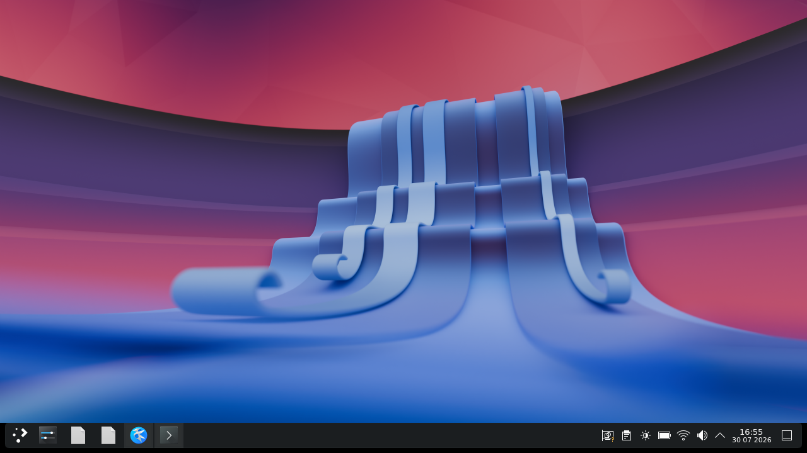
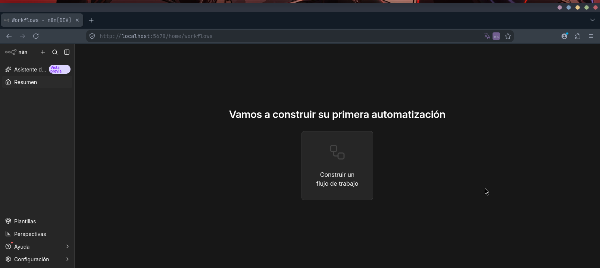
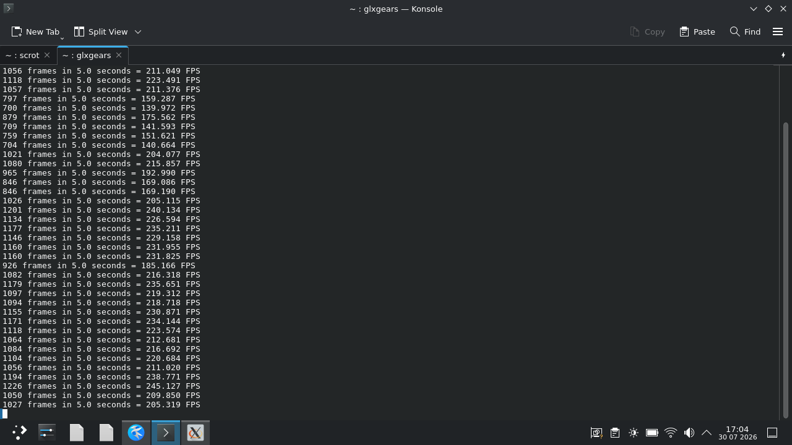
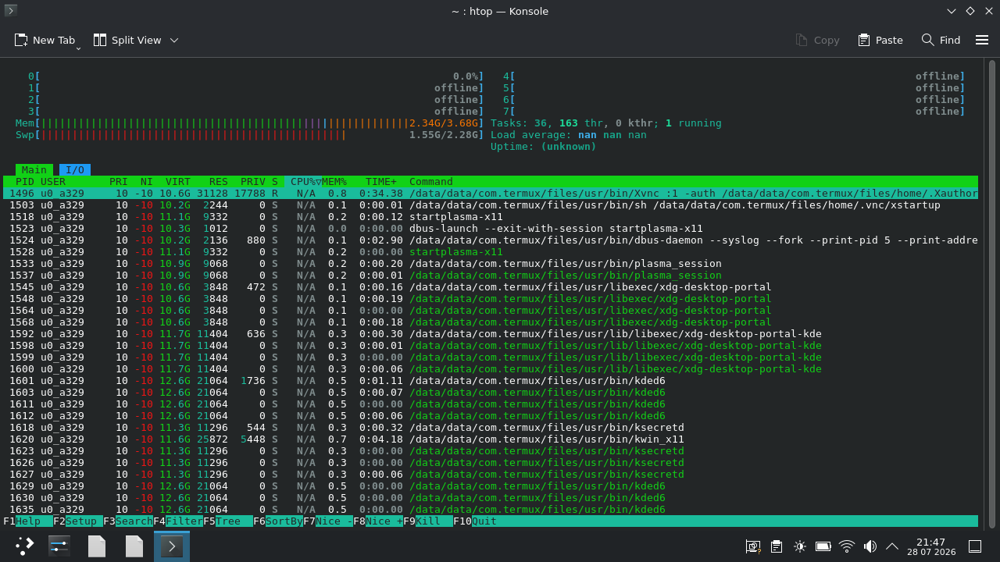

# 📱 Termux-Dev-Station
La guía definitiva para convertir Termux en un entorno de desarrollo gráfico acelerado por GPU y asistido por IA. KDE Plasma, VS Code, Godot Engine, OpenCode (Ollama), n8n y PulseAudio en tu Android. Paso a paso, estable y sin scripts ocultos. ¡Perfecto para DeX o monitor externo!

> 🚀 **¿Listo para convertir tu Android en un PC de desarrollo asistido por IA?** Sigue esta guía y tendrás KDE Plasma, Godot, VS Code, n8n y OpenCode funcionando en minutos. ¡No necesitas root ni scripts mágicos!

---


---

## 💡 Filosofía del Proyecto

He pasado por muchas guías desactualizadas y scripts opacos que rompen el sistema. Esta guía **no** utiliza un script de automatización a ciegas. Está diseñada paso a paso porque entender cómo funciona el entorno donde corren tus herramientas es fundamental.

Ya sea que estés maquetando interfaces con **HTML, CSS y JavaScript nativos**, optimizando código con tu **IA local**, creando mecánicas en **Godot Engine** o desplegando automatizaciones en **n8n**, ejecutar e interiorizar cada comando te garantizará el control absoluto de tu estación de desarrollo portátil.

---

## ⚡ Aceleración de Hardware GPU (Mali / MediaTek / Exynos via VirGL + Vulkan + ANGLE)

A diferencia de la mayoría de las guías enfocadas exclusivamente en Adreno, esta configuración habilita la **aceleración por GPU real en procesadores con GPU Mali**. 

Al delegar el renderizado 3D e interfaz a la GPU en lugar de forzar a la CPU con renderizado por software, el rendimiento se dispara, el consumo energético cae y el dispositivo se mantiene completamente **frío (~36 °C)** bajo cargas pesadas de trabajo.

---

## 🚀 ¿Qué obtendrás al final?
* **Entorno de escritorio:** KDE Plasma fluido, ligero y estable en Android.
* **Aceleración por GPU:** Renderizado nativo con VirGL sobre ANGLE/Vulkan para GPUs Mali/MediaTek.
* **Servidor gráfico:** VNC Server configurado con resolución personalizada y sonido funcional mediante `pulseaudio`.
* **Estabilidad:** Solución definitiva al problema de Procesos Fantasma (*Phantom Processes Killer*) de Android 12+.
* **Herramientas de desarrollo:** 
  * **Asistencia por IA Local:** OpenCode integrado con Ollama (`qwen2.5-coder:1.5b`) para autocompletado y chat interactivo, 100% offline.
  * **Automatización de Flujos:** Servidor n8n integrado y optimizado.
  * **Videojuegos:** Godot Engine (2D/3D).
  * **Editores de código:** Visual Studio Code (Code-OSS).
  * **Runtimes:** Python y Node.js.
  * **Control de versiones:** Git y GitHub CLI.
  * **Utilidades del sistema:** `htop`, `wget`, `unzip`, `ripgrep` y funciones avanzadas de consola.
* **Mantenimiento y Automatización:** Scripts de arranque (`xstartup`), apagado seguro (`xshutdown`) y rutina de limpieza de espacio.

---

## 📋 Requisitos Mínimos y Rendimiento Real

### ⚙️ Requisitos Mínimos Recomendados
* **Sistema Operativo:** Android 8.0 o superior (Atención en Android 12+ con el *Phantom Process Killer*, solucionado en la Fase 6).
* **Memoria RAM:** 3 GB mínimo (4 GB recomendados para multitarea fluida con VS Code, Godot, n8n y el modelo de IA local).
* **Almacenamiento Libre:** 8 GB a 10 GB libres (abarca todo el entorno gráfico, paquetes de desarrollo, modelos de IA y dependencias de Node.js).
* **Aplicaciones auxiliares necesarias:** 
  * [Termux](https://f-droid.org/en/packages/com.termux/) (instalado vía F-Droid o GitHub Releases).
  * Cliente VNC (ej. RealVNC Viewer, bVNC o VNC Viewer).

---

### 📱 Dispositivo de Prueba (Benchmarking)
Esta guía y su arquitectura fueron testeadas y optimizadas directamente en un equipo de **gama de entrada** para garantizar la máxima eficiencia:

| Parámetro | Especificación del entorno de prueba |
| :--- | :--- |
| **Dispositivo** | Tecno Spark 10C |
| **Procesador / GPU** | Octa-Core (GPU Mali-G57) |
| **Tasa de Refresco** | **200+ FPS** sostenidos en `glxgears` vía VirGL |
| **Memoria RAM Física** | 4 GB |
| **Prueba de Carga Simultánea** | 🎨 **Godot Engine** + 💻 **Code-OSS** + 🌐 **Firefox** + 🤖 **OpenCode / Ollama** + ⚡ **n8n** |

---

## 🖼️ Vista Previa del Entorno

Así se ve tu nueva estación de desarrollo una vez completada la guía:

| Escritorio KDE Plasma | Editor de código VS Code |
|-----------------------|--------------------------|
|  |  |

| Motor de videojuegos Godot | Asistente de IA con OpenCode |
|----------------------------|------------------------------|
|  |  |

| Automatización con n8n | Rendimiento GPU (VirGL / glxgears) |
|------------------------|------------------------------------|
|  |  |

| Navegación web con Firefox | Monitor del Sistema (htop) |
|---------------------------|----------------------------|
|  |  |

---

## 📖 Instrucciones de Instalación Paso a Paso

### 💡 Paso Previo: Descarga la APK Optimizada para tu Arquitectura

Antes de iniciar la Fase 1, se recomienda instalar la versión de Termux adecuada para tu procesador en lugar del paquete universal:

* **Versión Universal (F-Droid):** Pesa **~100 MB** porque incluye librerías para todas las arquitecturas.
* **Versión Optimizada (Recomendada desde GitHub Releases de Termux):**
  * Dispositivos de 64 bits: Descarga el APK **`arm64-v8a`** (reduce el tamaño a solo **~30 MB**).
  * Dispositivos de 32 bits: Descarga la versión **`armeabi-v7a`**.

---

## Fase 1: Preparación del Sistema Base
Otorga permisos de almacenamiento, selecciona el servidor espejo más rápido y actualiza los paquetes básicos:

```bash
termux-setup-storage
termux-change-repo
pkg update && pkg upgrade -y
```

---

## Fase 2: Expansión de Repositorios y Capa de Aceleración GPU (Mali VirGL)
Añade los repositorios adicionales, las herramientas de red y la capa de aceleración gráfica para procesadores Mali:

```bash
pkg install tur-repo x11-repo -y
pkg install git unzip wget curl ripgrep -y
pkg install virglrenderer-android angle-android mesa-demos -y
```

### Modos de Ejecución del Servidor VirGL
Puedes iniciar el servidor VirGL de acuerdo a las capacidades de tu dispositivo:

```bash
# Opción 1: ANGLE + Vulkan (Recomendado para GPU Mali - Silencia logs no críticos)
virgl_test_server_android --angle-vulkan 2>/dev/null &

# Opción 2: ANGLE + OpenGL ES
virgl_test_server_android --angle-gl 2>/dev/null &

# Opción 3: Modo Nativo (Fallback)
virgl_test_server_android 2>/dev/null &
```

---

## Fase 3: Configuración del Asistente IA Local (Ollama + OpenCode)

### 1. Instalación de Ollama y Descarga del Modelo
```bash
pkg install ollama -y
ollama serve &
```

En una **nueva pestaña de terminal**, descarga el modelo liviano especializado en código:
```bash
ollama pull qwen2.5-coder:1.5b
```

### 2. Instalación de los Binarios de OpenCode
```bash
curl -L -o opencode.zip [https://github.com/guysoft/opencode-termux/releases/latest/download/opencode-1.17.9-android-aarch64.zip](https://github.com/guysoft/opencode-termux/releases/latest/download/opencode-1.17.9-android-aarch64.zip)
unzip opencode.zip

mkdir -p $PREFIX/libexec/opencode $PREFIX/lib
mv opencode $PREFIX/bin/opencode
chmod +x $PREFIX/bin/opencode

mv opencode.bin $PREFIX/libexec/opencode/opencode.bin
chmod +x $PREFIX/libexec/opencode/opencode.bin

mv libtagfix.so libc++_shared.so libopentui.so $PREFIX/lib/
```

### 3. Vinculación de OpenCode con Ollama
Añade las variables de entorno a tu perfil de consola:

```bash
echo 'export OPENAI_API_KEY="ollama"' >> ~/.bashrc
echo 'export OPENAI_API_BASE="http://localhost:11434/v1"' >> ~/.bashrc
source ~/.bashrc
```

---

## Fase 4: Despliegue de n8n y Mantenimiento de Espacio

### 1. Instalación de n8n
Ejecuta el instalador verificado para Termux:

```bash
curl -o termux-n8n.sh [https://raw.githubusercontent.com/DevCoreXOfficial/termux-n8n/main/termux-n8n.sh](https://raw.githubusercontent.com/DevCoreXOfficial/termux-n8n/main/termux-n8n.sh)
chmod +x termux-n8n.sh
bash termux-n8n.sh
```

### 2. Rutina Agresiva de Limpieza de Almacenamiento
Dado que n8n y las dependencias de Node.js / Python pueden consumir espacio, ejecuta esta rutina para recuperar gigabytes de memoria:

```bash
# Limpiar caché acumulada de npm y pip
npm cache clean --force
pip cache purge

# Limpiar paquetes instaladores .deb y temporales del sistema
pkg clean
apt autoremove --purge
rm -rf $PREFIX/tmp/*
```

---

## Fase 5: Instalación del Entorno Gráfico y Herramientas Dev

Instala KDE Plasma, herramientas de audio, desarrollo, servidor VNC y aplicaciones principales:

```bash
pkg install plasma htop konsole dolphin -y
pkg install android-tools tigervnc -y
pkg install pulseaudio firefox godot -y
pkg install python nodejs code-oss code-is-code-oss -y
```

---

## Fase 6: Solución de Procesos Fantasma (Vía ADB Inalámbrico)

Desactiva la restricción *Phantom Process Killer* de Android 12+ mediante depuración por red:

1. Activa la **Depuración por Wi-Fi** en Opciones de Desarrollador.
2. Empareja y conecta Termux:
   ```bash
   adb pair 192.168.xxx.xxx:xxxxx xxxxxx
   adb connect 192.168.xxx.xxx:xxxxx
   ```
3. Desactiva el límite de procesos:
   ```bash
   adb shell "/system/bin/device_config set_sync_disabled_for_tests persistent"
   adb shell "/system/bin/device_config put activity_manager max_phantom_processes 2147483647"
   adb shell settings put global settings_enable_monitor_phantom_procs false
   ```

---

## Fase 7: Configuración del Servidor VNC

Crea la configuración inicial del servidor gráfico:

```bash
vncserver
vncserver -kill :1
```

---

## Fase 8: Configuración del Script de Inicio (`~/.vnc/xstartup`)

Abre el editor:
```bash
nano ~/.vnc/xstartup
```

Pega el siguiente script completo con soporte VirGL y limpieza automática:

```bash
#!/data/data/com.termux/files/usr/bin/sh

# Configuración de variables VNC
localhost="no"

# Activar el renderizado VirGL nativo para GPU Mali
export GALLIUM_DRIVER=virpipe
export MESA_GL_VERSION_OVERRIDE=4.0

# Desactivar funciones de gestión de energía que causan bloqueos
xset s off &
xset -dpms &

# Variables para OpenCode / Ollama en la sesión gráfica
export OPENAI_API_KEY="ollama"
export OPENAI_API_BASE="http://localhost:11434/v1"

# Configurar localización e idioma
export LANG=es_ES.UTF-8
export LANGUAGE=es_ES.UTF-8
export LC_ALL=C.UTF-8

# Configurar directorios temporales nativos de Termux
export TMPDIR=/data/data/com.termux/files/usr/tmp
export XDG_RUNTIME_DIR=${TMPDIR}
export QT_QPA_PLATFORM=xcb

# --- BLOQUE DE LIMPIEZA AUTOMÁTICA PREVIA A LA SESIÓN ---
# Eliminar sockets colgados de X11, D-Bus y PulseAudio
rm -rf $TMPDIR/.X11-unix/X*
rm -rf $TMPDIR/dbus-*
rm -rf $TMPDIR/pulse-*

# Limpiar caché de fuentes, vistas previas e interfaces de KDE/Qt
rm -rf $HOME/.cache/ico*
rm -rf $HOME/.cache/kio*
rm -rf $HOME/.cache/plasma*
rm -rf $HOME/.cache/QtWebEngine

# Eliminar archivos de bloqueo de sesiones anteriores
rm -f $HOME/.config/session/*
# --------------------------------------------------------

# Iniciar PulseAudio adaptado a Termux
pulseaudio --start --exit-idle-time=-1 2>/dev/null

# Cargar recursos gráficos básicos
[ -r $HOME/.Xresources ] && xrdb $HOME/.Xresources

# Desactivar el compositor del gestor de ventanas para evitar pérdida de rendimiento
xfwm4 --replace --compositor=off & 2>/dev/null

# Arrancar KDE Plasma envuelto en una sesión D-Bus activa
dbus-launch --exit-with-session startplasma-x11
```

Asigna permisos de ejecución:
```bash
chmod +x ~/.vnc/xstartup
```

---

## Fase 9: Configuración del Script de Cierre (`~/.vnc/xshutdown`)

Abre el editor:
```bash
nano ~/.vnc/xshutdown
```

Pega el siguiente script de apagado limpio:

```bash
#!/data/data/com.termux/files/usr/bin/sh

export TMPDIR=/data/data/com.termux/files/usr/tmp

# 1. Terminar procesos gráficos, servidor VirGL y VNC
kquitapp5 plasmashell 2>/dev/null
killall startplasma-x11 2>/dev/null
pkill virgl_test
pkill Xvnc

# 2. Detener D-Bus y PulseAudio
killall dbus-daemon 2>/dev/null
pulseaudio --kill 2>/dev/null

# 3. Limpieza de sockets temporales y archivos de bloqueo
rm -rf $TMPDIR/.X11-unix/X*
rm -rf $TMPDIR/dbus-*
rm -rf $TMPDIR/pulse-*
```

Asigna permisos de ejecución:
```bash
chmod +x ~/.vnc/xshutdown
```

---

## 🕹️ Flujo Diario de Trabajo y Verificación de Rendimiento GPU

### 1. Iniciar la Estación de Trabajo
```bash
# Iniciar servidor VirGL (Aceleración Vulkan)
virgl_test_server_android --angle-vulkan 2>/dev/null &

# Arrancar el servidor VNC (Ajusta la resolución a tu gusto)
vncserver -geometry 1280x720 -depth 24
```

Conéctate con tu cliente VNC en Android a `127.0.0.1:5901`.

### 2. Verificar Aceleración Gráfica por Hardware
Abre `Konsole` dentro de KDE Plasma y ejecuta:

```bash
glxinfo | grep -E "OpenGL vendor|OpenGL renderer|OpenGL version"
glxgears
```

### 3. Apagado Seguro del Sistema
```bash
~/.vnc/xshutdown
vncserver -kill :1
```

---

## 🤝 Créditos y Contribuciones

Este proyecto fue desarrollado mediante pruebas intensivas de optimización en arquitectura ARM / Termux.

* **Script de Despliegue de n8n:** Agradecimiento a [DevCoreXOfficial/termux-n8n](https://github.com/DevCoreXOfficial/termux-n8n) por el instalador optimizado de n8n para Termux.
* **Compilación de OpenCode para Termux:** Reconocimiento al proyecto [opencode-termux de GuySoft](https://github.com/guysoft/opencode-termux) por compilar las librerías nativas (`libopentui.so`, `libtagfix.so`) para `aarch64`.
* **Arquitectura GPU Mali & Integración System-Wide:** Diseño de scripts de arranque/apagado, perfiles VirGL/Vulkan y optimización de memoria por el autor original del repositorio.

---

## 📜 Licencia

Este proyecto está bajo la licencia **MIT**. Eres libre de usarlo, modificarlo y compartirlo.
